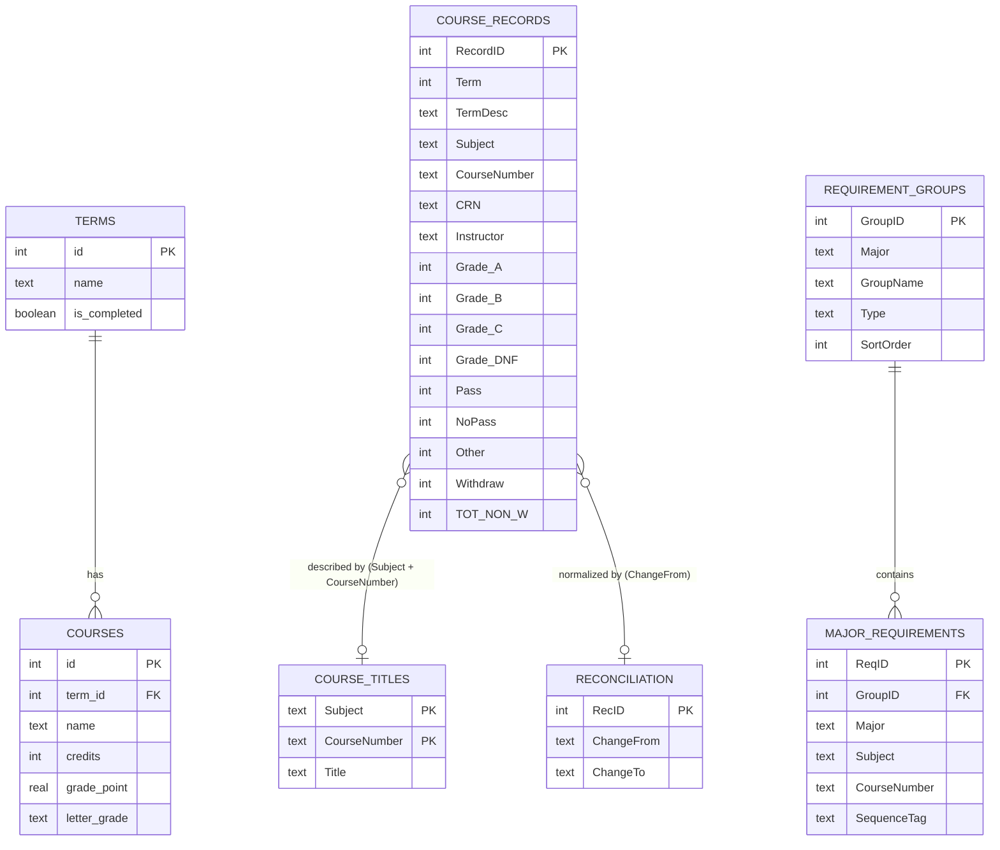
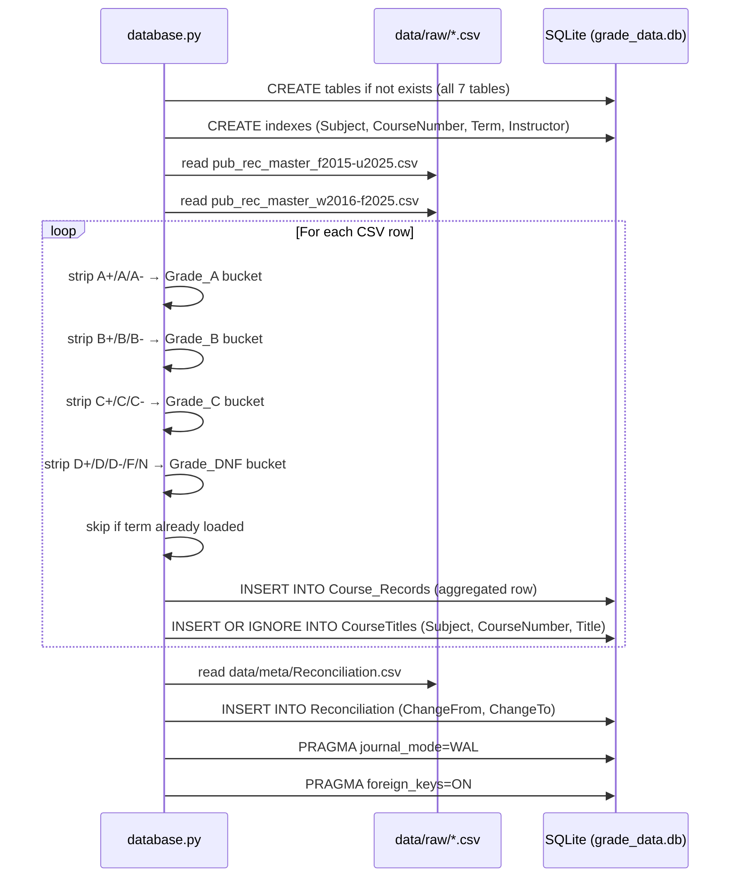
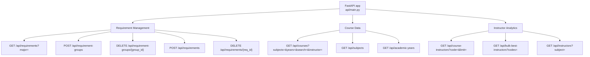
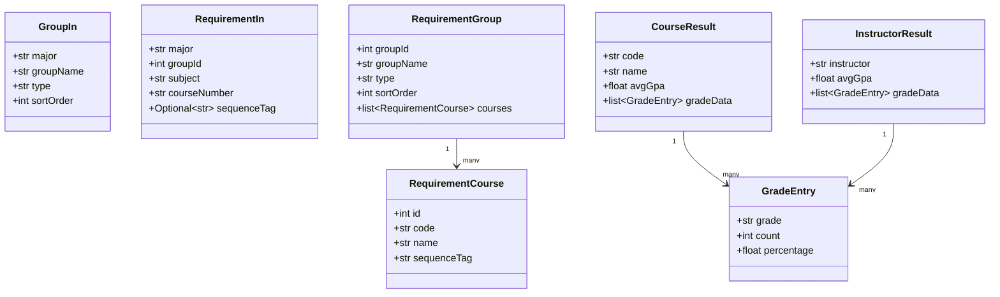
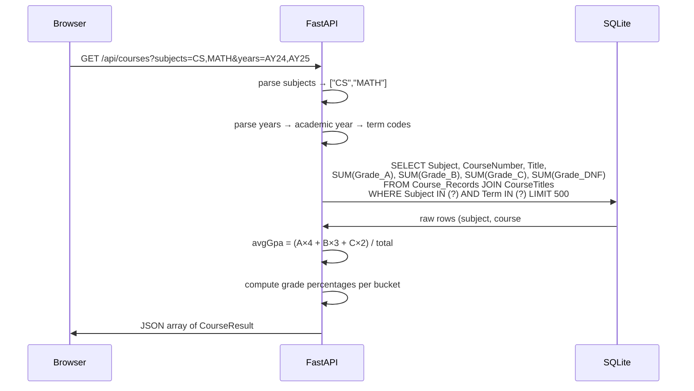
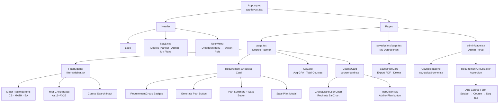
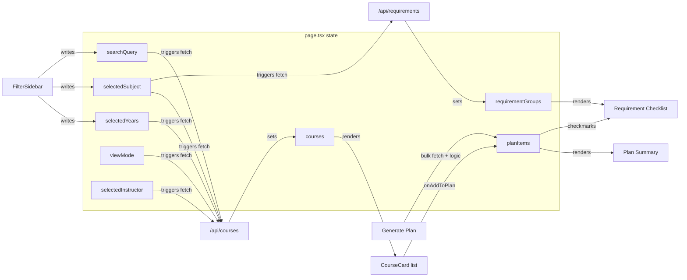
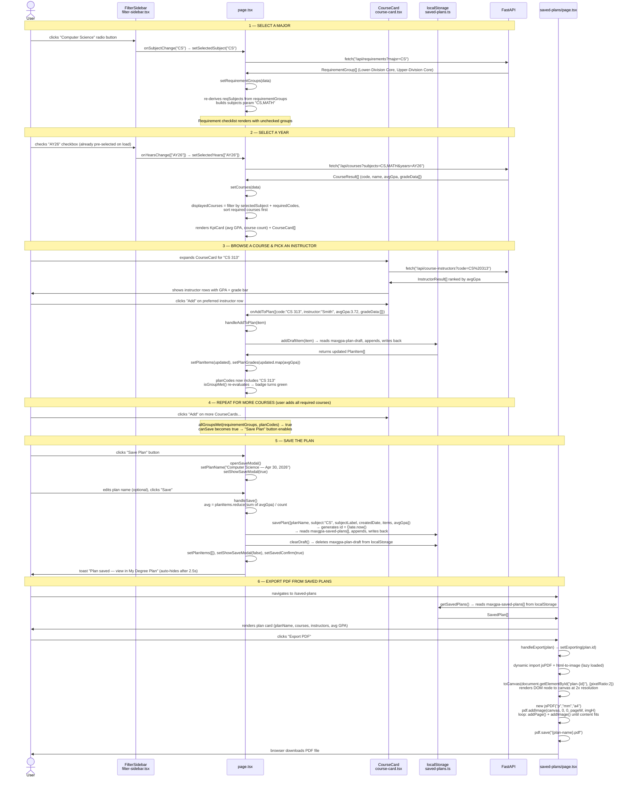
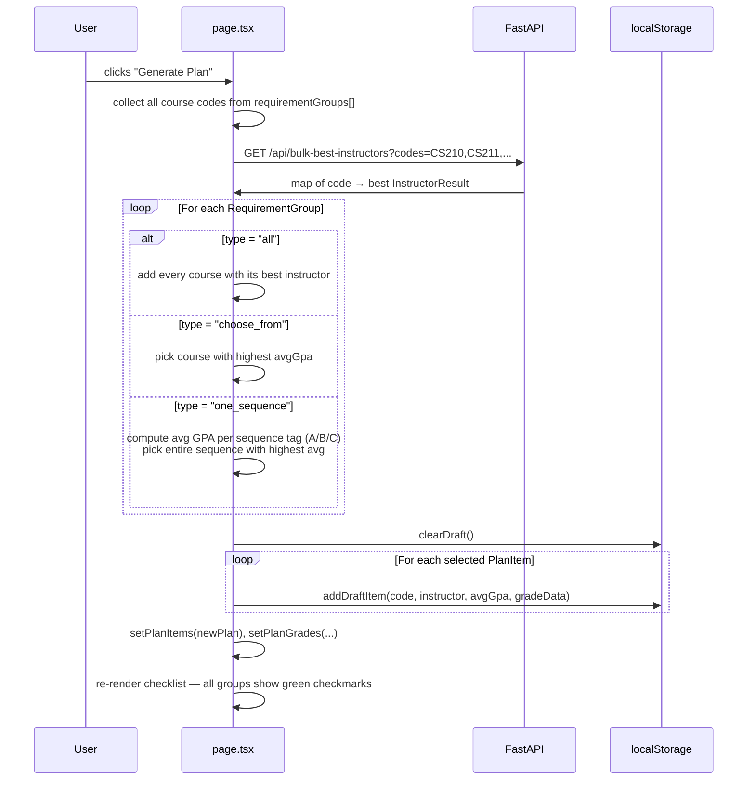

# MaxGPA — Architecture & UML Diagrams

Three-layer architecture: **SQLite database** ← **FastAPI backend** ← **Next.js frontend**.

```
Browser  ──►  Next.js (port 3000)  ──►  FastAPI (port 8000)  ──►  SQLite (grade_data.db)
```

All data fetching is client-side `fetch()` from `"use client"` components — the browser calls FastAPI directly. This works for local demo use; for production deployment FastAPI would need to be reachable from the internet or server actions would be used instead.

---

## Layer 1 — Database (SQLite)

The database has three distinct concerns stored in one file (`db/grade_data.db`):
- **Grade history** — imported from raw CSV files at startup (`Course_Records`, `CourseTitles`, `Reconciliation`)
- **Student planning** — lightweight runtime tables (`terms`, `courses`)
- **Degree requirements** — managed via admin UI (`Requirement_Groups`, `Major_Requirements`)

### 1a. Entity-Relationship Diagram (static)



### 1b. Database Initialization Sequence (dynamic)

How raw CSV data is loaded into SQLite at startup via `db/database.py`.



---

## Layer 2 — API (FastAPI)

`api/main.py` exposes 11 async endpoints. All queries use parameterized SQL directly against SQLite — no ORM.

### 2a. Endpoint Map (static)



### 2b. Data Model Class Diagram (static)

Request bodies (Pydantic) and response shapes used across the API.



### 2c. "Get Courses" Request Sequence (dynamic)

Full lifecycle of a `GET /api/courses` call — the most complex query in the system.



---

## Layer 3 — Next.js App

Three pages under `app/` using the App Router. All data fetching is client-side `fetch()`.

### 3a. Component Hierarchy (static)



### 3b. State & Data Flow (static)

State owned by `page.tsx` and which components read or write each variable.



### 3c. User Journey — Select Major → Pick Courses → Save → Export PDF (dynamic)

End-to-end walkthrough of the primary user flow. Each arrow names the exact function, state variable, or API call responsible.



### 3d. "Generate Optimal Plan" Sequence (dynamic)

Alternative to manually picking courses — auto-selects the best instructor per requirement group.


